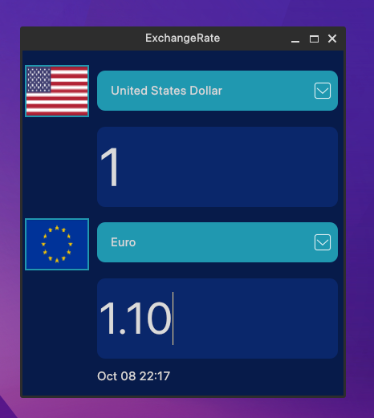

# Exchange Rate Application - PyQt6 GUI 

## Development Requirements
> Operational System: Linux/Windows 

> GUI Framework: PyQt6 With QtDesigner  

> Programming Language: Python

> API : ExchangeRate-API (Free Version - Limited)  
>	Official Website: https://www.exchangerate-api.com/

## Layout

## Funcionalities

> Use this application to be informed about the exchange Rate.

> This API doesn't support updates in real time. (24 Hour Updates) last day update: oct 9

> Select in the first Combo Box the first currency.

> After that, select the second combo box below to the second currency.

> By default, the system start with American Dollar currency and Euro currency.

***PROBELM*** : ***The time request should be slow, so wait like 2 and 3 seconds to see the conversion.***

## Instalation

- Download "ExchangeRate.exe" in [RELEASES](https://github.com/bentogomes19/ExchangeRateGUI-API/releases/tag/v1.0.0) or just clone the project and run the file main.py in the terminal.

